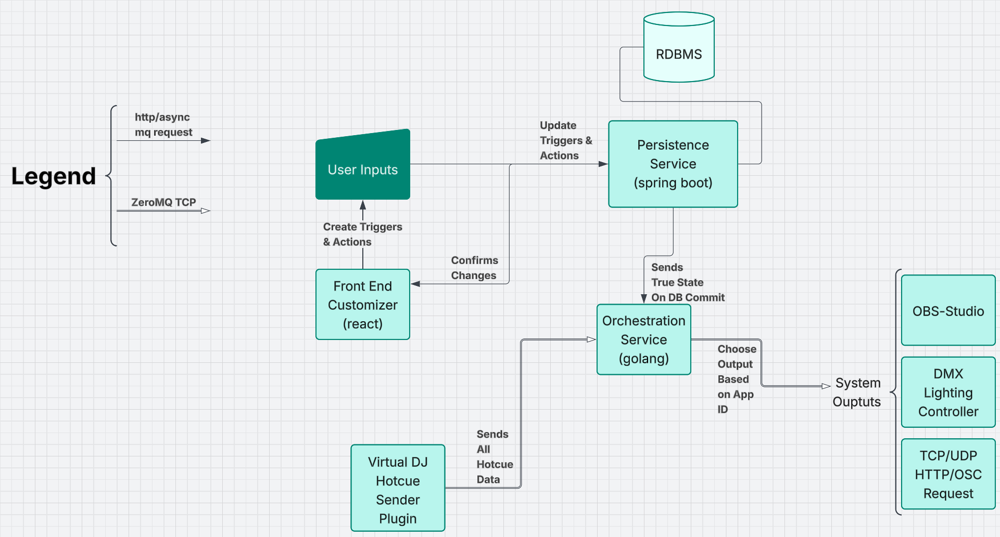

# Event-Driven Media Orchestration Platform

A real-time, event-driven orchestration system that connects **VirtualDJ hotcues**, **OBS Studio**, and external output systems through a persistent trigger/action model.

This platform allows users to configure automation rules (triggers → actions) that react to live DJ events and execute system-level outputs with deterministic behavior and state consistency.

---

## Architecture Overview

---

## System Overview

The system is built around strict separation of responsibilities:

| Component | Responsibility |
|------------|---------------|
| Frontend (React) | User configuration of triggers and actions |
| Persistence Service (Spring Boot) | Authoritative configuration storage |
| RDBMS | Durable state |
| Orchestration Service (Go) | In-memory rule engine and event router |
| VirtualDJ Plugin | Emits hotcue events via ZeroMQ |
| Output Systems | OBS, DMX, TCP/UDP/OSC endpoints |

---

## High-Level Flow

### 1. Configuration Phase

1. User creates or updates triggers/actions in the React frontend.
2. Changes are sent to the Persistence Service (Spring Boot).
3. Persistence layer writes to the RDBMS.
4. On successful database commit:
   - The authoritative state is transmitted to the Orchestration Service.
   - The frontend receives confirmation of applied changes.

This ensures:

- No partial configuration propagation
- Runtime state only reflects committed database state
- Deterministic orchestration behavior

---

### 2. Runtime Event Processing

1. The VirtualDJ Hotcue Sender Plugin emits hotcue metadata over ZeroMQ (TCP).
2. The Orchestration Service:
   - Maintains an in-memory representation of committed triggers/actions.
   - Listens to incoming VirtualDJ events.
   - Matches events against configured triggers.
   - Executes associated actions.
3. Outputs are routed to:
   - OBS Studio (via receiver plugin)
   - TCP / UDP / HTTP / OSC endpoints
   - Optional DMX lighting controller (.NET service)

---

## Core Design Principles

### Authoritative State

Only the database defines truth.
The orchestration service mirrors committed state and does not originate configuration.

### Event-Driven Execution

All runtime behavior is driven by incoming events, not polling.

### Separation of Concerns

- Configuration logic is isolated from runtime orchestration.
- Persistence is isolated from execution.
- Output systems are loosely coupled and replaceable.

### Deterministic Behavior

Triggers fire only when:

- Configuration has been committed
- A runtime event matches defined criteria
- The in-memory orchestration state is consistent

---

## Component Breakdown

### Frontend Customizer (React)

- UI for defining triggers and actions
- Sends HTTP requests to persistence layer
- Receives confirmation after commit

---

### Persistence Service (Spring Boot)

- Exposes REST API
- Validates and stores configuration
- Emits authoritative state snapshot on commit

---

### Orchestration Service (Go)

- Maintains in-memory rule engine
- Subscribes to configuration updates
- Listens to VirtualDJ hotcue events via ZeroMQ
- Routes matched triggers to output handlers

---

### VirtualDJ Hotcue Sender Plugin

- Transmits hotcue metadata during playback
- Emits all hotcue events
- Contains no business logic

---

### OBS Studio Receiver Plugin

- Receives orchestration commands
- Executes scene changes, filters, transitions, etc.

---

### DMX Lighting Controller (.NET, Optional)

- External lighting abstraction layer
- Polymorphic hardware controller
- Not required for current runtime

---

## Communication Channels

| Source | Destination | Protocol |
|---------|-------------|----------|
| Frontend | Persistence Service | HTTP |
| Persistence | Orchestration | Async message / internal API |
| VirtualDJ | Orchestration | ZeroMQ TCP |
| Orchestration | Outputs | TCP / UDP / HTTP / OSC |

---

## Tech Stack

- React
- Spring Boot
- Go
- PostgreSQL (or compatible RDBMS)
- ZeroMQ
- OBS Studio Plugin SDK
- .NET (lighting controller)

---

## Architectural Goals

- Real-time responsiveness
- Strict configuration authority
- Modular output integrations
- Low-latency event matching
- Clean boundary enforcement between state and execution
